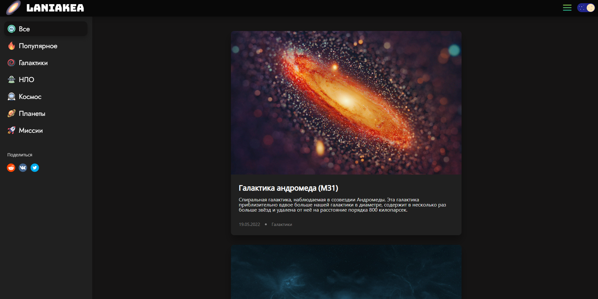
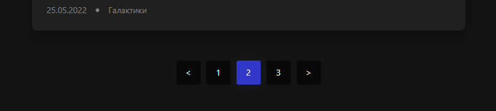

# 
LANIAKEA

 

---

### Описание
Название "LANIAKEA" выбрано в честь Ланиакеи - суперскопления галактик, в котором находится и наше Млечное Путь. Это символизирует объединение различных тем и материалов о космосе на одной платформе, подобно тому, как суперскопление объединяет галактики. [https://laniakea.eridani.site](https://laniakea.eridani.site)
---
### Стек:
- Go
- Gin
- Docker
- Docker Compose
- PostgreSQL
---
### Пагинация:
Реализована пагинация

 

